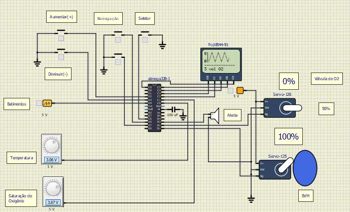

# Respirador-Mecânico-ATmega328P
"Respirador mecânico" virtual, similar ao utilizado no tratamento da COVID-19, utilizando o Atmega328P do software SimulIDE

## Funções
Esse respirador possui uma serie de funções :
### Vizualização de BPM, temperatura , saturação de 02 e também um medidor de pressão arterial em sua entrada serial.
### Configuração de resp/min , volume de oxigênio , e abertura de válvula de O2 em tempo real
### Além disso, é possível fazer agendamento de parametros
### também é possível transmitir valores dos sinais medidos via serial, o notbook "Tx", ilustra a possíbilidade de uso dessa função.

